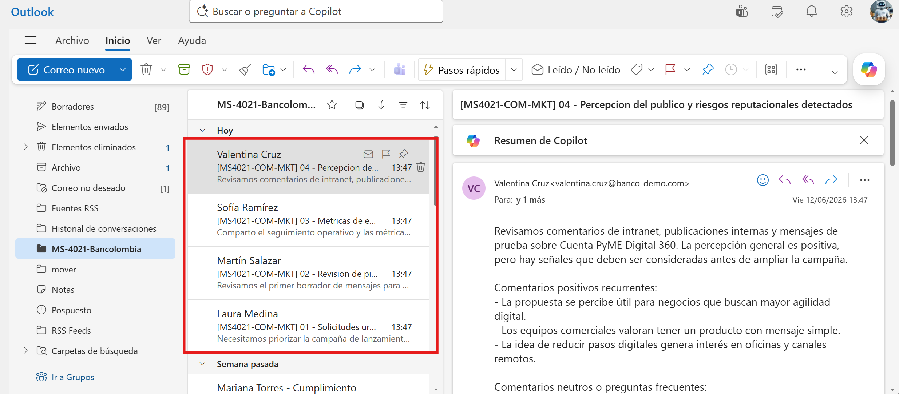
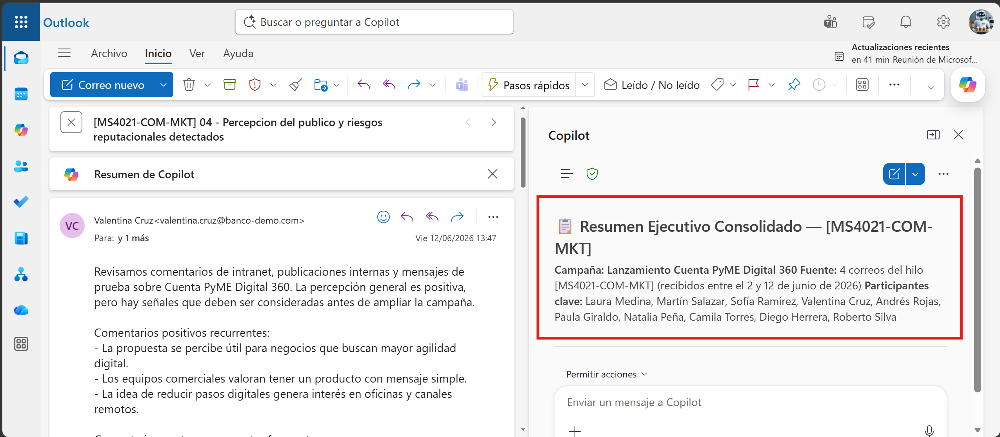
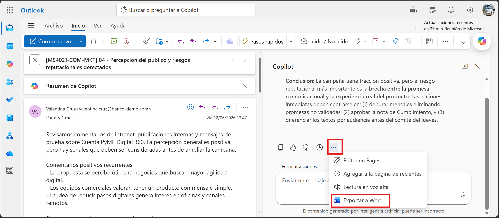
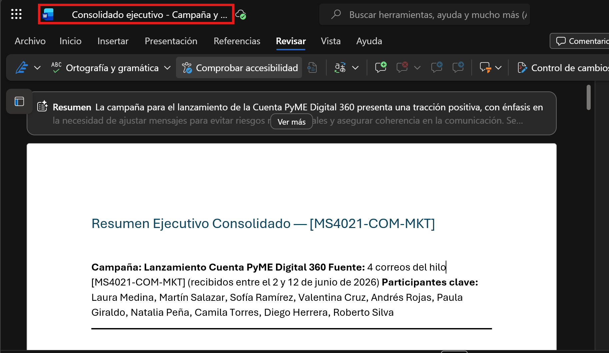
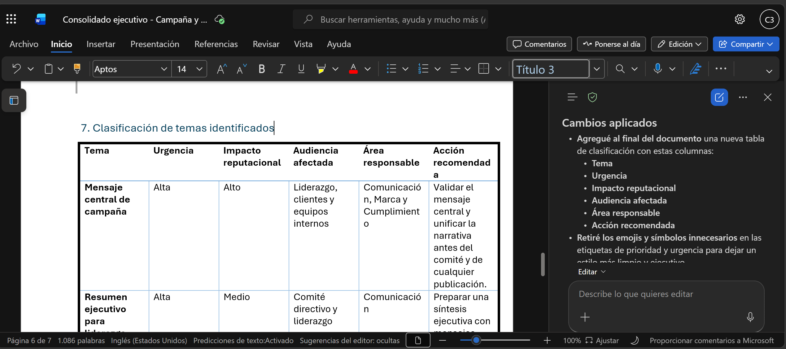
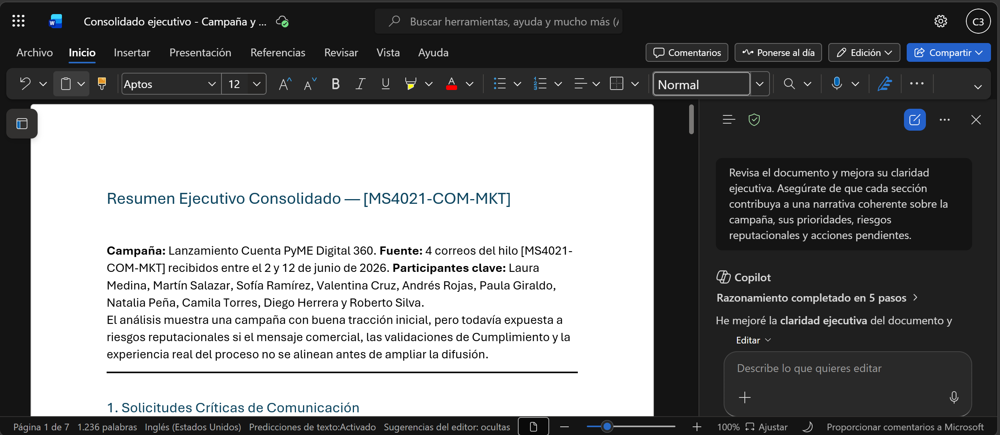

# Demostración 1. Preparar el contexto de comunicación y marketing desde Outlook

## Objetivo de la práctica:
Al finalizar la práctica, serás capaz de:
- Priorizar correos relacionados con campañas, solicitudes de comunicación y riesgos reputacionales.
- Usar Copilot en Outlook para resumir correos con foco ejecutivo, urgencia, impacto y acciones pendientes.
- Construir un bloque de contexto que alimente el análisis posterior en Excel, Copilot Analyst y Word.

## Duración aproximada:
- 15 minutos.

## Tabla de ayuda:
| Elemento | Valor de referencia | Observaciones |
| --- | --- | --- |
| Aplicación principal | Outlook con Microsoft 365 Copilot | Usar cuenta corporativa con licencia de Microsoft 365 Copilot. |
| Escenario | Campaña interna y externa para Cuenta PyME Digital 360 | Producto financiero digital ficticio para PyMEs. |
| Seguridad de datos | Información ficticia | No usar información real de clientes, campañas o incidentes reputacionales. |

## Instrucciones 

El área de Comunicación y Marketing del banco debe preparar una campaña interna y externa para promover el producto ficticio **Cuenta PyME Digital 360**. El equipo debe coordinar piezas y publicaciones, analizar métricas de engagement y percepción, identificar riesgos reputacionales, adaptar mensajes según audiencias y preparar una presentación ejecutiva para liderazgo.

### Tarea 1. Preparar el buzón y localizar correos de campaña.

**Paso 1.** Abrir Outlook con la cuenta corporativa asignada para la demostración.

**Paso 2.** Buscar primero con el distintivo `[MS4021-COM-MKT]`. De forma complementaria, usar palabras clave como: `campaña`, `marketing`, `comunicación`, `marca`, `riesgo reputacional`, `publicaciones`, `intranet`, `clientes`, `PyME`, `Cuenta PyME Digital 360`.

**Paso 3.** Identificar los cuatro correos consolidados que representan las siguientes perspectivas:
- Solicitud urgente de campaña interna y externa.
- Revisión de piezas, lineamientos de marca y tono institucional.
- Métricas preliminares, comentarios y percepción de audiencias.
- Riesgo reputacional y ajustes de mensajes para el lanzamiento.



---

### Tarea 2. Usar Copilot en Outlook para resumir y priorizar la información.

**Paso 1.** Abrir el primer correo consolidado relacionado con la solicitud urgente de campaña.

**Paso 2.** Seleccionar Copilot en Outlook y solicitar un resumen ejecutivo.

Prompt sugerido:

```text
Resume esta cadena de correos desde una perspectiva ejecutiva para un equipo de Comunicación y Marketing de un banco. Identifica:
1. Tema principal.
2. Solicitudes urgentes de comunicación.
3. Piezas, canales y audiencias involucradas.
4. Riesgos reputacionales o de marca.
5. Áreas internas involucradas.
6. Decisiones o acciones pendientes.
7. Nivel de urgencia: alto, medio o bajo.
```

**Paso 3.** Revisar que el resumen no agregue datos no mencionados en el correo.

**Paso 4.** Repetir el análisis con los otros tres correos consolidados.

**Paso 5.** Solicitar a Copilot que consolide los cuatro resúmenes en un solo bloque ejecutivo.

Prompt sugerido:

```text
Consolida los resúmenes de los cuatro correos en un solo bloque ejecutivo para planeación de campaña. Prioriza la información según urgencia e impacto reputacional.

Organiza el resultado con esta estructura:
1. Solicitudes críticas de comunicación.
2. Piezas y publicaciones prioritarias.
3. Audiencias involucradas.
4. Riesgos reputacionales o de marca.
5. Métricas o señales de percepción mencionadas.
6. Acciones pendientes y áreas responsables.
```



**Paso 6.** Al finalizar la respuesta, exportar a Word.



**Paso 7.** Cambiar el título del documento temporal a `Consolidado ejecutivo - Campaña y riesgo reputacional`.



>[!Nota]
> Explicar a los participantes que este resultado no es el entregable final. Es el contexto que permitirá contrastar correos con datos de campañas, percepción y engagement en Excel.

---

### Tarea 3. Validar prioridades antes de continuar.

**Paso 1.** Pedir a Copilot que clasifique los temas por urgencia e impacto.

Prompt sugerido:

```text
Al final del documento, clasifica los temas identificados en una tabla con las columnas: Tema, Urgencia, Impacto reputacional, Audiencia afectada, Área responsable y Acción recomendada. Además, retira los emojis y símbolos innecesarios.
```



**Paso 2.** Confirmar que el consolidado permita responder:
- ¿Qué campaña se debe preparar?
- ¿Qué piezas y canales son prioritarios?
- ¿Qué riesgos reputacionales existen?
- ¿Qué áreas deben participar?
- ¿Qué información se debe validar con datos?

**Paso 3.** Deja el documento en una estructura clara, profesiona y con enfoque ejecutivo, para usarlo como referencia en el análisis de métricas, percepción y estrategia. 

Prompt sugerido:

```text 
Revisa el documento y mejora su claridad ejecutiva. Asegúrate de que cada sección contribuya a una narrativa coherente sobre la campaña, sus prioridades, riesgos reputacionales y acciones pendientes.
```

### Resultado esperado
Al finalizar, el instructor debe contar con un consolidado ejecutivo generado desde Outlook con solicitudes, prioridades, riesgos reputacionales, audiencias y acciones pendientes para la campaña de Cuenta PyME Digital 360.

