# Demostración 2. Analizar métricas de campaña, percepción y engagement con Copilot en Excel y Copilot Analyst

## Objetivo de la práctica:
Al finalizar la práctica, serás capaz de:
- Usar Copilot en Excel para monitorear publicaciones, responsables, estados de piezas y métricas de engagement.
- Identificar tendencias de interacción, variaciones relevantes y riesgos reputacionales a partir de comentarios.
- Utilizar Copilot Analyst para convertir métricas y percepción en insights accionables para comunicación y marketing.

## Duración aproximada:
- 20 minutos.

## Tabla de ayuda:
| Elemento | Valor de referencia | Observaciones |
| --- | --- | --- |
| Aplicaciones principales | Excel con Copilot, Microsoft 365 Copilot Chat, Copilot Analyst | Usar cuenta corporativa con Microsoft 365 Copilot. |
| Archivo base | `Metricas_Campana_Producto_Digital_Banco.xlsx` | Dataset ficticio de campañas, parrilla, comentarios y buyer personas. |
| Insumo previo | Consolidado de Outlook | Generado en la Demostración 1. |


## Instrucciones 

### Tarea 1. Abrir el archivo y revisar la estructura de datos.

**Paso 1.** Abrir Excel en el navegador o en la aplicación de escritorio.

**Paso 2.** Abrir el archivo `Metricas_Campana_Producto_Digital_Banco.xlsx` desde OneDrive o SharePoint.

**Paso 3.** Revisar las hojas:
- `Campañas_Publicaciones`
- `Parrilla_Contenido`
- `Comentarios_Percepcion`
- `Buyer_Personas`
- `Resumen_Ejecutivo`

**Paso 4.** Activar Copilot en Excel desde la cinta de opciones.

>[!Nota]
> Explicar que los datos son ficticios y sirven para evaluar seguimiento operativo, engagement, percepción, riesgos reputacionales y oportunidades de ajuste comunicacional.

---

### Tarea 2. Monitorear publicaciones y avance operativo.

**Paso 1.** En la hoja `Parrilla_Contenido`, solicitar a Copilot un resumen del avance por estado.

Prompt sugerido:

```text
Analiza la hoja Parrilla_Contenido y resume el avance operativo de las piezas de campaña. Identifica cuántas piezas están en diseño, revisión de marca, revisión de cumplimiento, publicadas o pausadas. Presenta el resultado en una tabla ejecutiva en una nueva hoja llamada `Resumen_Avance_Operativo`.
```

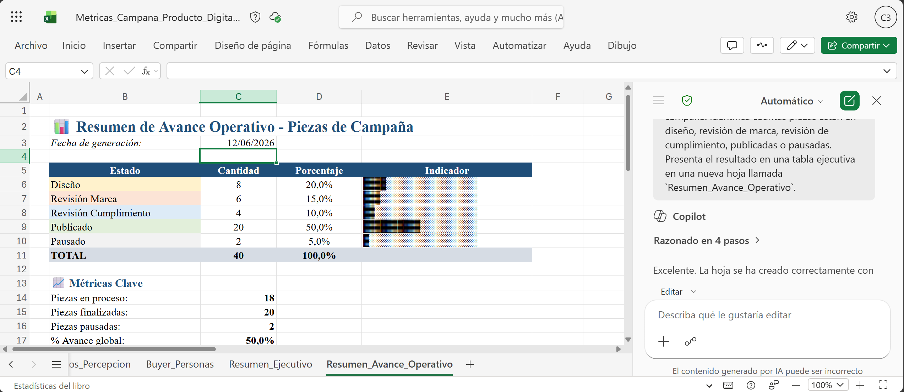

**Paso 2.** Solicitar el análisis de responsables y carga de trabajo.

Prompt sugerido:

```text
Identifica la distribución de carga de trabajo por responsable en la hoja Parrilla_Contenido. Señala responsables con mayor volumen de piezas, piezas críticas pendientes y posibles riesgos de retraso.
```

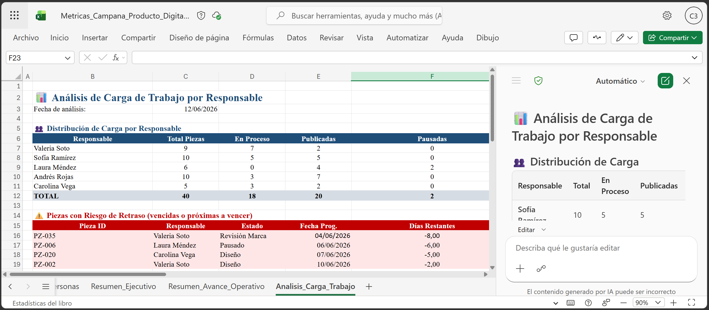

**Paso 3.** Pedir a Copilot que resalte filas críticas.

Prompt sugerido:

```text
Resalta las filas en la hoja `Parrilla_Contenido` donde la prioridad sea Alta o el riesgo sea Alto. Explica qué piezas, canales y audiencias requieren atención inmediata antes del lanzamiento.
```

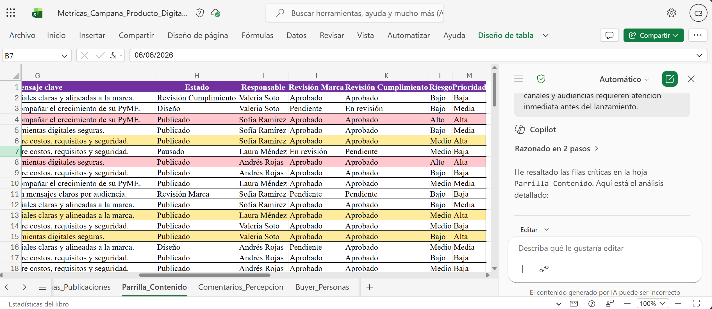

---

### Tarea 3. Analizar engagement y desempeño por canal.

**Paso 1.** Ir a la hoja `Campañas_Publicaciones`.

**Paso 2.** Solicitar una comparación de engagement por canal.

Prompt sugerido:

```text
Analiza la hoja Campañas_Publicaciones y compara el desempeño por canal usando visualizaciones, clics, interacciones, comentarios, CTR y avance de publicación. Identifica los canales con mejor y menor desempeño.
```

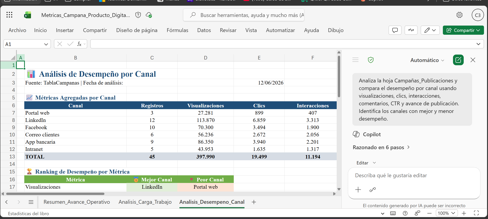

**Paso 3.** Pedir a Copilot que identifique variaciones relevantes.

Prompt sugerido:

```text
Detecta variaciones relevantes en métricas de engagement entre publicaciones, canales o periodos. Explica qué cambios podrían requerir ajustes de mensaje, canal o audiencia, dame la respuesta en el chat.
```

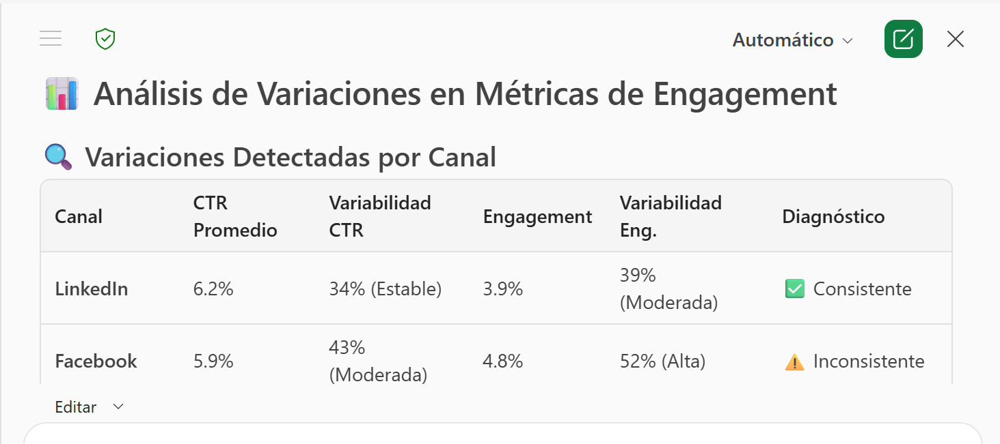

**Paso 4.** Solicitar una tabla ejecutiva de campañas con oportunidad de mejora.

Prompt sugerido:

```text
Crea una tabla ejecutiva con las campañas o publicaciones que requieren mejora. Incluye campaña, canal, audiencia, métrica afectada, posible causa, acción recomendada y prioridad.
```

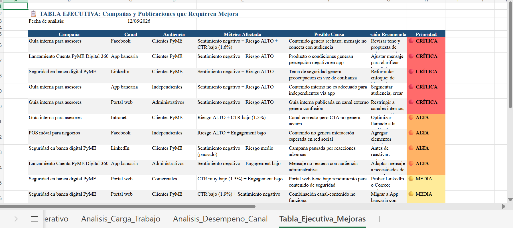

---

### Tarea 4. Analizar percepción, sentimiento y riesgos reputacionales.

**Paso 1.** Abrir la hoja `Comentarios_Percepcion`.

**Paso 2.** Solicitar a Copilot un resumen de temas y sentimiento.

Prompt sugerido:

```text
Resume los temas más frecuentes en los comentarios y clasifica la percepción general como positiva, neutra o negativa en una nueva columna en la hoja `Comentarios_Percepcion`. Relaciona cada tema con posible impacto reputacional.
```

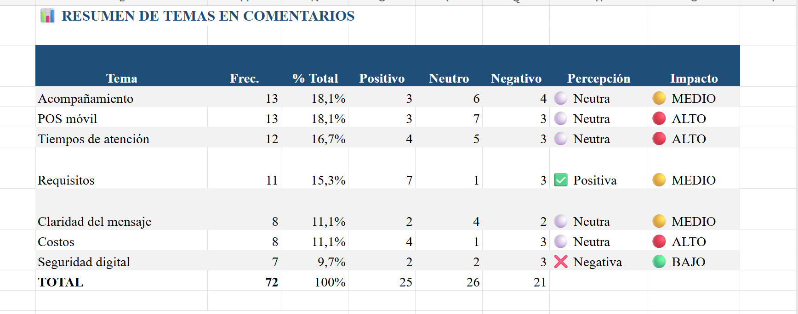

**Paso 3.** Usar Agente Analista de Copilot, si está disponible, para profundizar en patrones de comportamiento y sentimiento.

Prompt sugerido:

```text
Actúa como analista de comunicación y reputación. Analiza los comentarios, temas, canales y audiencias para identificar patrones de percepción, riesgos reputacionales emergentes y señales que deberían atenderse antes de publicar la campaña completa.
```

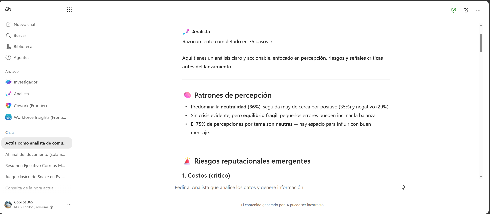

**Paso 4.** Solicitar una interpretación que conecte métricas operativas con percepción de usuarios.

Prompt sugerido:

```text
Relaciona las métricas de desempeño de campaña con la percepción del usuario. Explica qué hallazgos van más allá de los datos operativos y qué ajustes estratégicos recomendarías para mejorar claridad, confianza y conversión.
```

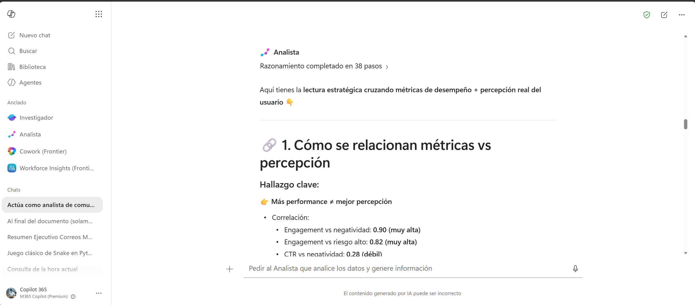

**Paso 5.** Pedir a Copilot que resuma los hallazgos clave para diseñar la estrategia de comunicación.

Prompt sugerido:

```text
Resume los hallazgos clave de seguimiento operativo, engagement, percepción y riesgos reputacionales que deberían considerarse para diseñar la estrategia de comunicación de la campaña. No uses emojis y sé conciso.
```
---

### Tarea 5. Consolidar hallazgos para la estrategia en Word.

**Paso 1.** Consolidar hallazgos para planear la campaña de cuenta PyME Digital 360. Adjunta excel, información extraida de outlook y trabaja sobre los resultados del agente analista.

Prompt sugerido:

```text
Actúa como consultor de Comunicación y Marketing para un banco. Con base en la respuesta anterior y los hallazgos adjuntos, genera un análisis ejecutivo para planear la campaña de Cuenta PyME Digital 360.

Incluye:
1. Resumen ejecutivo.
2. Estado operativo de piezas y publicaciones.
3. Canales con mejor y menor desempeño.
4. Temas de percepción y sentimiento.
5. Riesgos reputacionales detectados.
6. Recomendaciones de ajuste de mensaje.
7. Métricas de seguimiento.
8. Insumos que deben pasar a Word para redactar la estrategia.
```

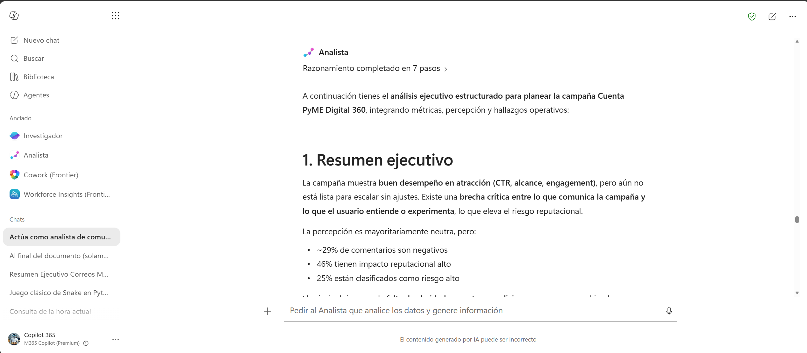

**Paso 3.** Solicitar una versión lista para ser usada como insumo en Word.

Prompt sugerido:

```text
Convierte el análisis anterior en un brief estructurado para Word con estas secciones:
1. Contexto de campaña.
2. Objetivos de comunicación.
3. Públicos objetivo.
4. Hallazgos de engagement.
5. Hallazgos de percepción.
6. Riesgos reputacionales.
7. Recomendaciones estratégicas.
8. Próximos pasos.
```

**Paso 4.** Exportar resultado a Word para usarlo como base en la redacción de la estrategia de comunicación. Nombrarlo como `Brief_Estrategia_Comunicacion_Cuenta_PyME_Digital_360.docx`.

### Resultado esperado
Al finalizar, el instructor debe contar con hallazgos consolidados sobre seguimiento operativo, engagement, percepción, riesgos reputacionales y recomendaciones para diseñar la estrategia de comunicación.

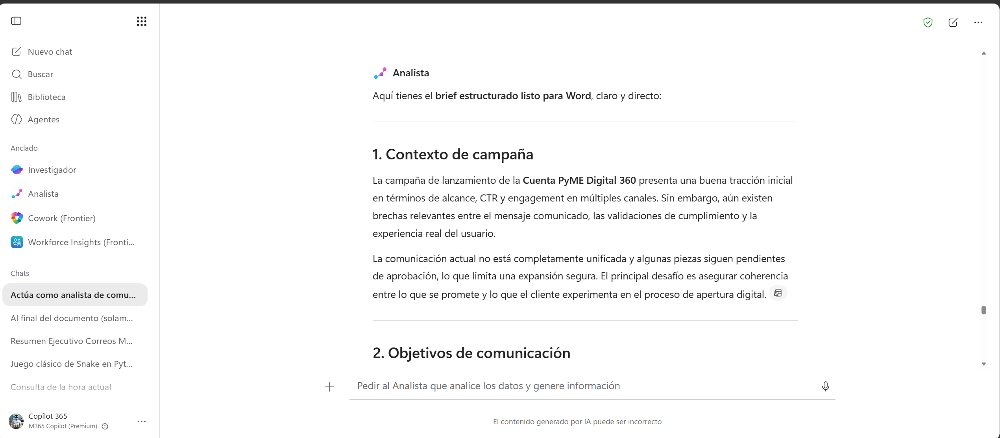