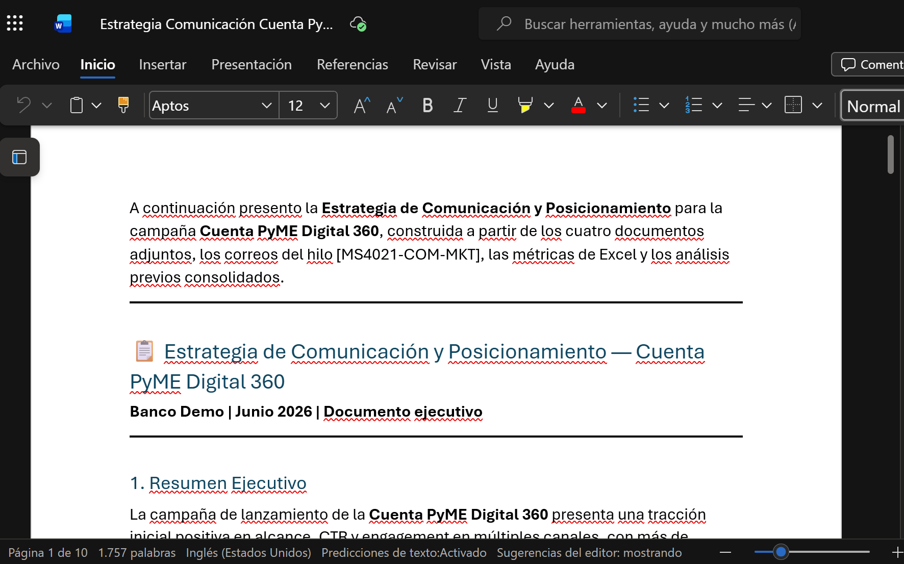
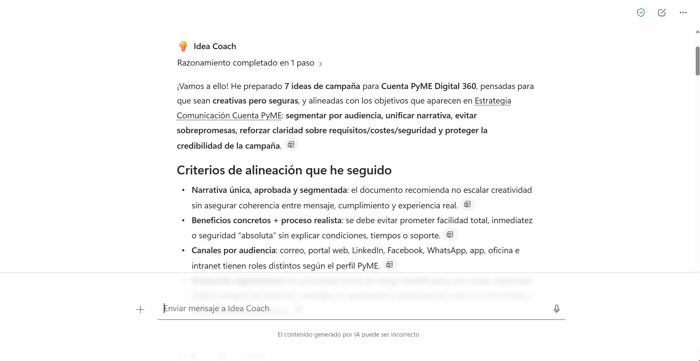
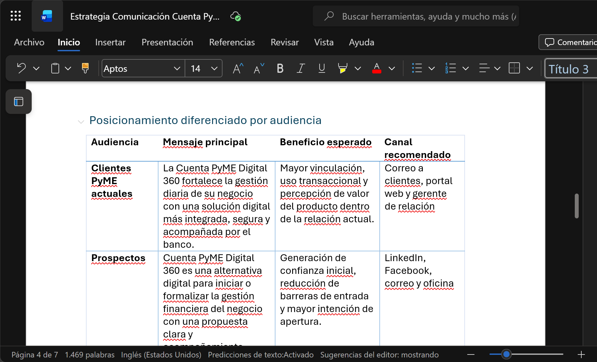
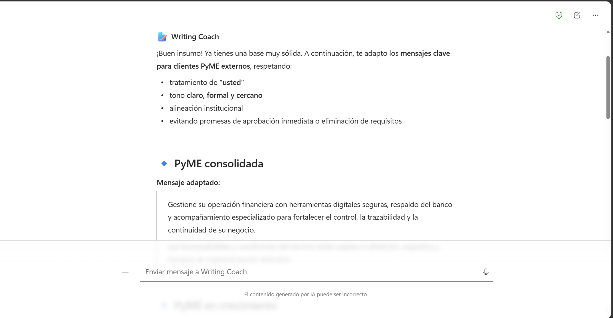
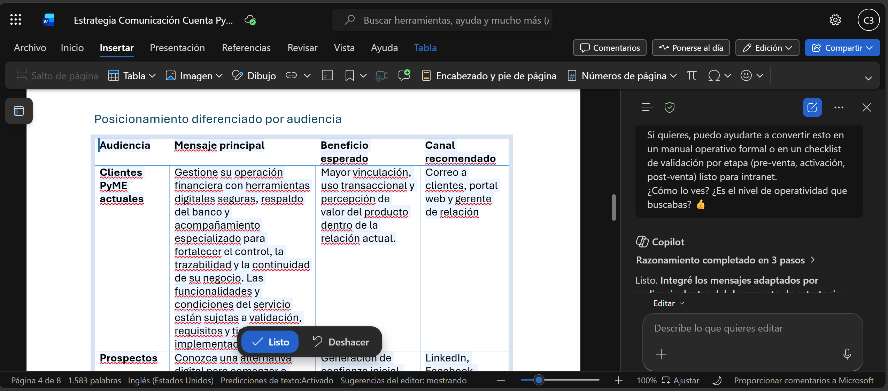
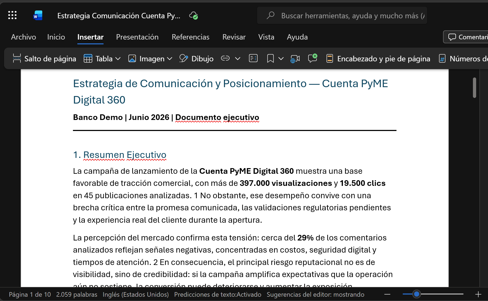

# Demostración 3. Diseñar estrategia de comunicación con Copilot en Word, Idea Coach y Writing Coach

## Objetivo de la práctica:
Al finalizar la práctica, serás capaz de:
- Usar Copilot en Word para redactar una estrategia de comunicación y posicionamiento a partir de hallazgos previos.
- Generar ideas de campaña con Idea Coach considerando objetivos, audiencias, lineamientos de marca y riesgos reputacionales.
- Adaptar mensajes con Writing Coach para distintos públicos, tonos, niveles de formalidad y canales.

## Duración aproximada:
- 20 minutos.

## Tabla de ayuda:
| Elemento | Valor de referencia | Observaciones |
| --- | --- | --- |
| Aplicación principal | Word con Microsoft 365 Copilot | Usar cuenta corporativa con licencia de Microsoft 365 Copilot. |
| Coaches | Idea Coach y Writing Coach | Usar según disponibilidad del entorno. |
| Insumos | Brief de Outlook/Excel, buyer personas, lineamientos de marca, brief de producto | Documentos ficticios incluidos en el kit. |

## Instrucciones 

### Tarea 1. Crear el documento base de estrategia.

**Paso 1.** Abrir nuevo chat en Microsoft 365 Copilot Chat desde `https://m365.cloud.microsoft.com/`.

**Paso 2.** Adjuntar o referenciar los siguientes archivos desde OneDrive o SharePoint:
- `Brief_Producto_Cuenta_PyME_Digital_360.docx`
- `Lineamientos_Marca_Comunicacion_Banco_Demo.docx`
- `Buyer_Personas_Campana_PyME_Digital.docx`
- El brief generado desde Outlook, Excel y Agente Analista en las demostraciones anteriores. `Brief_Estrategia_Comunicacion_Cuenta_PyME_Digital_360.docx`

**Paso 3.** Solicitar a Copilot que redacte la estrategia, usa modelo GPT o Cloude.

Prompt sugerido:

```text
Redacta una estrategia de comunicación y posicionamiento para la campaña Cuenta PyME Digital 360. Usa los documentos adjuntos y los hallazgos previos de Outlook, Excel y Agente Analista en las demostraciones anteriores.

La estrategia debe incluir:
1. Resumen ejecutivo.
2. Contexto de la campaña.
3. Objetivos de comunicación.
4. Públicos objetivo y buyer personas.
5. Mensajes clave por audiencia.
6. Canales recomendados.
7. Riesgos reputacionales y mitigaciones.
8. Métricas de seguimiento.
9. Próximos pasos.

Usa tono ejecutivo, claro y alineado con lineamientos institucionales.
```

**Paso 4.** Exportar a word y nombrar el documento como `Estrategia_Comunicacion_Cuenta_PyME_Digital_360.docx`.


---

### Tarea 2. Refinar estructura, objetivos y mensajes clave.

**Paso 1.** Pedir a Copilot que mejore la estructura y enfoque ejecutivo.

Prompt sugerido:

```text
Revisa el documento y mejora su claridad ejecutiva. Reduce redundancias, fortalece la relación entre hallazgos de métricas, percepción y decisiones de campaña, y asegúrate de que cada sección contribuya a una estrategia accionable. Adicional quita los emojis.
```



**Paso 2.** Solicitar una tabla de públicos, mensajes y canales.

Prompt sugerido:

```text
Crea una tabla con las columnas: Público objetivo, necesidad principal, mensaje clave, tono recomendado, canal prioritario, riesgo de comunicación y ajuste sugerido.
```

**Paso 3.** Solicitar una sección de posicionamiento por audiencia.

Prompt sugerido:

```text
Agrega una sección llamada "Posicionamiento diferenciado por audiencia". Incluye clientes PyME actuales, prospectos, asesores comerciales, administrativos internos y liderazgo. Para cada audiencia, define mensaje principal, beneficio esperado y canal recomendado.
```



---

### Tarea 3. Usar Idea Coach para generar ideas de campaña.

**Paso 1.** Abrir Idea Coach desde la experiencia disponible de Copilot.

**Paso 2.** Solicitar ideas de campaña alineadas al objetivo del producto.

Prompt sugerido:

```text
Genera ideas de campaña para promover Cuenta PyME Digital 360. Las ideas deben estar alineadas con los objetivos de comunicación, lineamientos de marca y riesgos reputacionales identificados.

Incluye para cada idea:
1. Nombre de campaña.
2. Concepto creativo.
3. Audiencia objetivo.
4. Mensaje central.
5. Canales sugeridos.
6. Riesgo reputacional a mitigar.
7. Razón por la que podría funcionar.
```


**Paso 3.** Solicitar enfoques creativos para distintos públicos.

Prompt sugerido:

```text
Propón tres enfoques creativos diferenciados: uno para clientes PyME actuales, uno para prospectos y uno para equipos comerciales internos. Mantén coherencia con un banco formal y evita promesas absolutas sobre aprobación o disponibilidad de productos.
```

**Paso 4.** Incorporar al documento las ideas seleccionadas.

---

### Tarea 4. Usar Writing Coach para adaptar mensajes.

**Paso 1.** Seleccionar los mensajes clave generados en el documento. De la tabla Matriz de Audiencia.

**Paso 2.** Pedir a Writing Coach que adapte el mensaje para clientes externos usando tratamiento de usted.

Prompt sugerido:

```text
Adapta los mensajes para clientes PyME externos. Usa tratamiento de "usted", tono claro, formal y cercano. Mantén el mensaje alineado con lineamientos institucionales y evita prometer aprobación inmediata o eliminación de requisitos.
```



**Paso 3.** Adaptar el mensaje para equipos comerciales.

Prompt sugerido:

```text
Adapta los mensajes para asesores comerciales. Usa un tono directo y accionable. Incluye argumentos para explicar beneficios, requisitos, seguridad digital y cómo responder dudas frecuentes del cliente.
```

**Paso 4.** Adaptar el mensaje para administrativos internos.

Prompt sugerido:

```text
Adapta los mensajes para equipos administrativos internos. Usa tono formal, operativo y claro. Enfatiza responsabilidades, canales de escalamiento, control de piezas y cuidado reputacional.
```

**Paso 5.** Extrae los resultados generados por writing coach y pidele a Copilot en Word que los integre al documento final de estrategia, manteniendo coherencia en formato y estilo.

Prompt sugerido:

```text
Integra los mensajes adaptados para cada audiencia en el documento de estrategia. Asegúrate de mantener coherencia en formato, estilo y tono con el resto del documento.
```



**Paso 6.** Refina el documento final con un prompt para mejorar su enfoque ejecutivo.

Prompt sugerido:

```text
Revisa el documento final y mejora su enfoque ejecutivo. Asegúrate de que se cubra con un documento de estrategia de comunicación y posicionamiento que integra hallazgos de datos, percepción, buyer personas, lineamientos de marca, ideas de campaña y mensajes adaptados por audiencia.
```

### Resultado esperado
Al finalizar, el instructor debe contar con un documento de estrategia de comunicación y posicionamiento que integra hallazgos de datos, percepción, buyer personas, lineamientos de marca, ideas de campaña y mensajes adaptados por audiencia.

