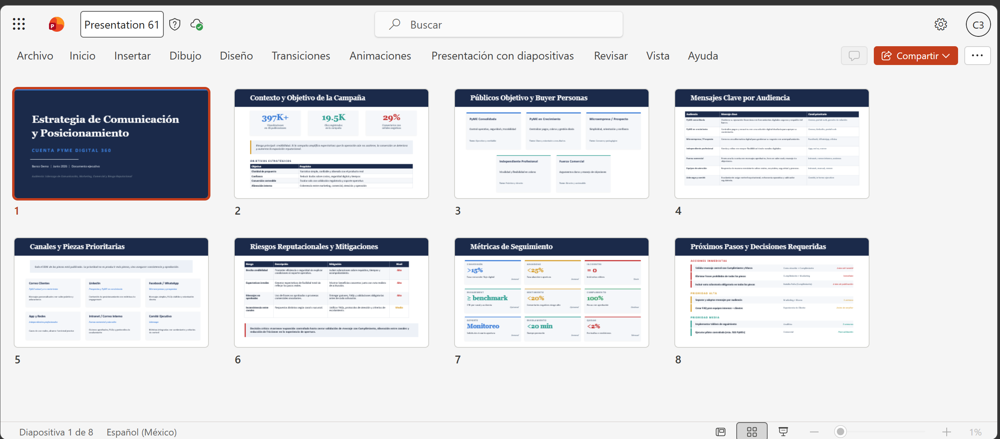
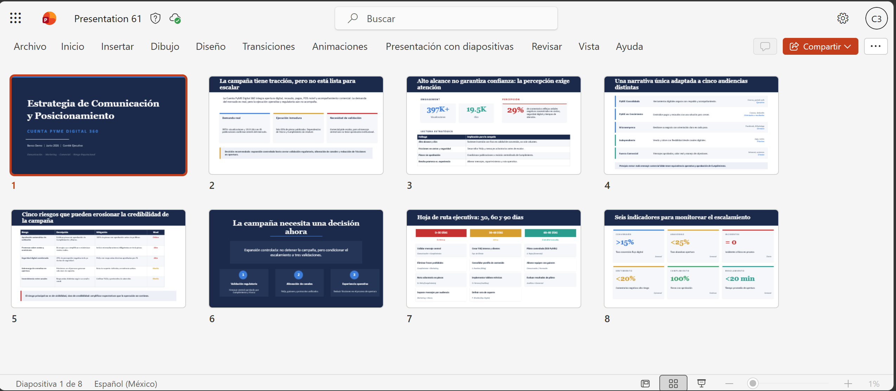
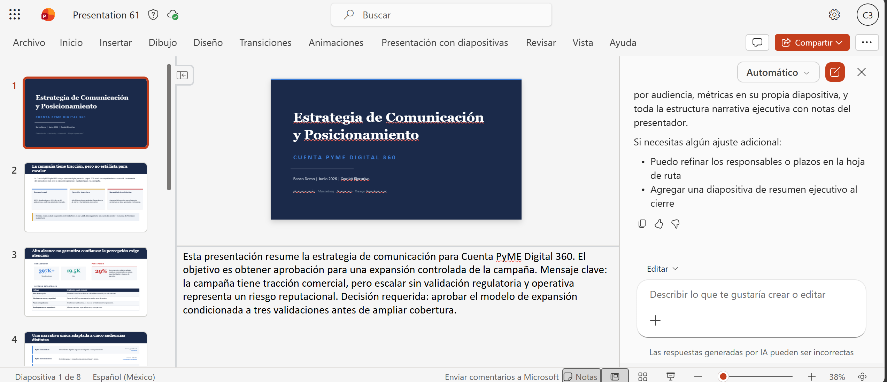
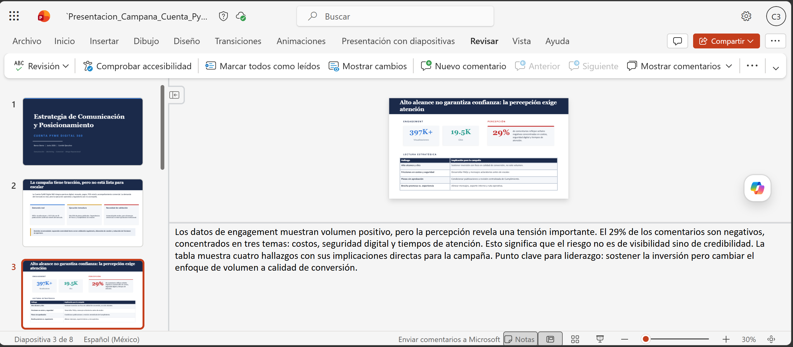

# Demostración 4. Crear una presentación ejecutiva de campaña y posicionamiento con Copilot en PowerPoint

## Objetivo de la práctica:
Al finalizar la práctica, serás capaz de:
- Crear una presentación ejecutiva con Copilot en PowerPoint a partir del documento de estrategia generado en Word.
- Refinar la narrativa de campaña para liderazgo, priorizando claridad, enfoque ejecutivo y decisiones requeridas.
- Preparar diapositivas sobre posicionamiento, audiencias, riesgos reputacionales, métricas y próximos pasos.

## Duración aproximada:
- 20 minutos.

## Tabla de ayuda:
| Elemento | Valor de referencia | Observaciones |
| --- | --- | --- |
| Aplicación principal | PowerPoint con Microsoft 365 Copilot | Usar cuenta corporativa con Copilot habilitado. |
| Insumo requerido | `Estrategia_Comunicacion_Cuenta_PyME_Digital_360.docx` | Documento generado en la Demostración 3. |


## Instrucciones 

### Tarea 1. Crear la presentación desde el documento de Word.

**Paso 1.** Abrir PowerPoint en el navegador o en la aplicación de escritorio.

**Paso 2.** Crear una presentación en blanco y abrir el panel de Copilot.

**Paso 3.** Seleccionar la opción para crear una presentación desde archivo o agregar contenido de trabajo.

**Paso 4.** Buscar el documento `Estrategia_Comunicacion_Cuenta_PyME_Digital_360.docx` en OneDrive o SharePoint.


**Paso 5.** Solicitar a Copilot una presentación ejecutiva.

Prompt sugerido:

```text
Crea una presentación ejecutiva de 8 diapositivas a partir de este documento. La audiencia es liderazgo de Comunicación, Marketing, Comercial y Riesgo Reputacional de un banco.

La presentación debe incluir:
1. Portada ejecutiva.
2. Contexto y objetivo de la campaña.
3. Públicos objetivo y buyer personas.
4. Mensajes clave por audiencia.
5. Canales y piezas prioritarias.
6. Riesgos reputacionales y mitigaciones.
7. Métricas de seguimiento.
8. Próximos pasos y decisiones requeridas.

Usa lenguaje ejecutivo, mensajes breves y enfoque visual.
```

**Paso 6.** Esperar a que Copilot genere el primer borrador y revisar la estructura de la presentación.


---

### Tarea 2. Refinar narrativa, claridad y enfoque ejecutivo.

**Paso 1.** Pedir a Copilot que reorganice la presentación en una secuencia de decisión.

Prompt sugerido:

```text
Reorganiza la presentación para que cuente una historia ejecutiva clara: necesidad de campaña, hallazgos de engagement y percepción, estrategia por audiencia, riesgos reputacionales, decisión requerida y próximos pasos.
```

**Paso 2.** Solicitar que Copilot mejore los títulos de las diapositivas.

Prompt sugerido:

```text
Mejora los títulos de las diapositivas para que sean mensajes ejecutivos, no solo nombres de secciones. Reduce el texto excesivo y deja únicamente los puntos clave para liderazgo.
```

**Paso 3.** Solicitar una diapositiva específica de riesgos reputacionales.

Prompt sugerido:

```text
Crea o refina una diapositiva sobre riesgos reputacionales y mitigaciones. Incluye riesgos relacionados con aprobación automática, costos, seguridad digital, sobrecarga de consultas e inconsistencia de mensajes.
```

**Paso 4.** Solicitar una diapositiva de calendario y próximos pasos.

Prompt sugerido:

```text
Convierte los próximos pasos en una línea de tiempo ejecutiva con acciones, responsables preliminares, prioridad y horizonte de 30, 60 y 90 días.
```



---

### Tarea 3. Generar notas del presentador y validar la entrega.

**Paso 1.** Solicitar a Copilot notas del presentador.

Prompt sugerido:

```text
Genera notas del presentador para cada diapositiva. Las notas deben ayudar al instructor a explicar el mensaje clave en menos de un minuto por diapositiva, con tono ejecutivo y orientado a decisiones.
```



**Paso 2.** Validar que la presentación responda:
- ¿Qué campaña se propone?
- ¿Qué audiencias se priorizan?
- ¿Qué mensajes y canales se recomiendan?
- ¿Qué riesgos reputacionales deben mitigarse?
- ¿Qué métricas deben seguirse?
- ¿Qué decisiones requiere liderazgo?

**Paso 3.** Guardar la presentación con el nombre `Presentacion_Campana_Cuenta_PyME_Digital_360`.

### Resultado esperado
Al finalizar, el instructor debe contar con una presentación ejecutiva de campaña y posicionamiento lista para revisión humana y exposición ante liderazgo.

